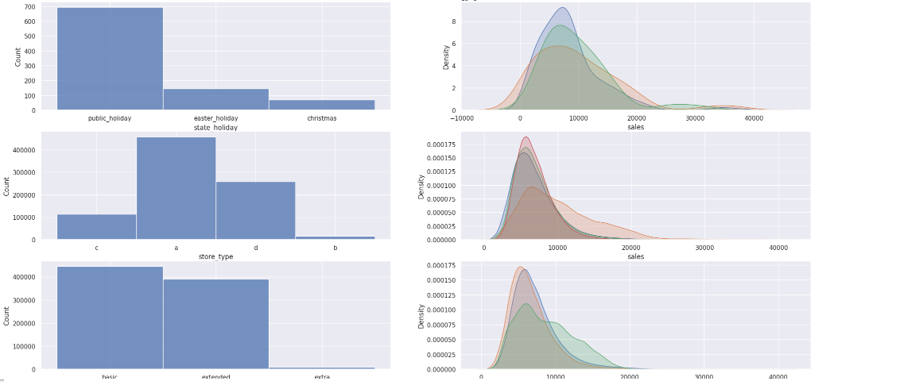

 
 <h1 align="center"> PREVISÃO DE VENDAS - LOJAS ROSSMANN </h1>
  
O projeto mencionado é uma iniciativa da comunidade DS (Data Science) com o objetivo de realizar uma previsão de vendas das lojas Rossmann para os próximos 6 meses. Os dados utilizados para esse fim são obtidos do Kaggle, uma plataforma online que reúne conjuntos de dados de diferentes domínios.

Para realizar essa previsão, o projeto utiliza algoritmos de machine learning, que são métodos computacionais capazes de aprender padrões nos dados e fazer previsões com base neles. Esses algoritmos são treinados com os dados históricos de vendas, buscando identificar relações e tendências que possam ajudar a prever as vendas futuras.

Além disso, o projeto segue o método de gerenciamento CRISP, que é uma abordagem amplamente utilizada em projetos de mineração de dados e análise preditiva. O CRISP consiste em uma série de fases iterativas, incluindo compreensão do negócio, compreensão dos dados, preparação dos dados, modelagem, avaliação e implantação. Ao seguir o CRISP, o projeto busca garantir uma abordagem estruturada e sistemática, permitindo a criação de um modelo de previsão de vendas mais preciso e confiável.
 
 
 
## 1.0. Questão de negócio
A Rossmann opera mais de 3.000 drogarias em 7 países europeus. Atualmente, os gerentes das lojas da Rossmann têm a tarefa de prever suas vendas diárias com antecedência de até seis semanas. As vendas das lojas são influenciadas por diversos fatores, incluindo promoções, concorrência, feriados escolares e estaduais, sazonalidade e localização. Com milhares de gerentes individuais prevendo vendas com base em suas circunstâncias únicas, a precisão dos resultados pode variar bastante.
 
## 2.0. Entendimento do Negócio
Contexto fictício: O CFO (Chief Financial Officer) tem interesse em alocar recursos de forma mais eficiente para as lojas da empresa. Para auxiliar nesse processo de alocação, ele busca realizar uma previsão de vendas das lojas para as próximas 6 semanas.

A previsão de vendas é uma ferramenta valiosa que permite ao CFO ter uma visão antecipada do desempenho esperado de cada loja no curto prazo. Com base nessas previsões, o CFO pode tomar decisões informadas sobre a alocação de recursos financeiros, como investimentos em estoque, contratação de pessoal adicional ou ajuste de despesas.

Para esse projeto será utilizado Aprendizado de Máquina Supervisionada de Regressão - Time Series.
 
## 3.0. Coleta de dados
Na etapa de coleta de dados para esse caso específico, é comum utilizar diferentes métodos, dependendo da fonte dos dados e da disponibilidade de acesso. Para esse caso foi realizado o download dos conjuntos de dados no formato csv por meio da plataforma kaggle.

[Kaggle dados Rossmann](https://www.kaggle.com/competitions/rossmann-store-sales)

Dados | descrição
------- | ---------
train.csv | dados históricos, incluindo as vendas
test.csv | dados históricos, excluindo as vendas
sample_submission.csv | um arquivo de exemplo de submissão no formato correto
store.csv | informações adicionais sobre as lojas

Campos de dados
A maioria dos campos é autoexplicativa. A seguir, estão as descrições para aqueles que não são:

Colunas | descrição
------- | ---------
Id | um ID que representa um par (Loja, Data) no conjunto de testes
Store | um ID único para cada loja
Sales | a receita para um determinado dia (isso é o que você está prevendo)
Customers | o número de clientes em um determinado dia
Open | um indicador se a loja estava aberta: 0 = fechada, 1 = aberta
StateHoliday | indica um feriado estadual. Normalmente, todas as lojas, com poucas exceções, estão fechadas em feriados estaduais. Observe que todas as escolas estão fechadas em feriados públicos e fins de semana. a = feriado público, b = feriado de Páscoa, c = Natal, 0 = Nenhum
SchoolHoliday | indica se (Loja, Data) foi afetada pelo fechamento de escolas públicas
StoreType | diferencia entre 4 modelos diferentes de loja: a, b, c, d
Assortment | descreve o nível de variedade: a = básico, b = extra, c = estendido
CompetitionDistance | distância em metros até a loja concorrente mais próxima
CompetitionOpenSince[Month/Year] | fornece o ano e mês aproximados da abertura da loja concorrente mais próxima
Promo | indica se a loja está executando uma promoção naquele dia
Promo2 | Promo2 é uma promoção contínua e consecutiva para algumas lojas: 0 = loja não está participando, 1 = loja está participando
Promo2Since[Year/Week] | descreve o ano e semana do calendário em que a loja começou a participar da Promo2
PromoInterval | descreve os intervalos consecutivos em que a Promo2 é iniciada, nomeando os meses em que a promoção é iniciada novamente. Por exemplo, "Fev, Mai, Ago, Nov" significa que cada rodada começa em fevereiro, maio, agosto e novembro de qualquer ano para aquela loja.
 
## 4.0. Limpeza dos dados
Durante a etapa de limpeza dos dados, foi realizado um tratamentos para lidar com valores vazios ou ausentes. A substituição desses valores vazios é uma prática importante para garantir a qualidade e consistência dos dados utilizados no projeto de previsão de vendas.

Existem várias abordagens que podem ser adotadas para tratar os valores vazios, e a escolha depende do contexto dos dados e da natureza do problema em questão. O método usado para substituir valores vazios foram com preenchimento com um valor padrão: Nesse caso, os valores vazios são substituídos por um valor específico ou um valor médio ou mediano dos dados existentes.
  
## 5.0. Exploração dos dados
Na etapa de exploração dos dados, o objetivo principal é obter um entendimento mais profundo do negócio por meio da análise dos dados disponíveis. Essa etapa envolve identificar padrões, relacionamentos e insights relevantes que possam ajudar a compreender melhor o comportamento dos dados e a tomar decisões embasadas. A seguir, são apresentadas algumas etapas comuns durante a exploração dos dados:

### 5.1. Análise descritiva 
Inicia-se com uma análise descritiva das variáveis disponíveis, como a média, mediana, desvio padrão, valores mínimos e máximos. Essa análise fornece uma visão geral do intervalo de valores, identificando possíveis discrepâncias ou anomalias nos dados.

attributes |	min |	max	| range	| mean	| median	| std	| skew	| kurtosis
---------- | --- | --- | ----- | ---- | ------ | --- | ---- | --------
store	| 1.0 |	1115.0 |	1114.0	| 558.429727 |	558.0 |	321.908493 |	-0.000955 |	-1.200524
day_of_week	| 1.0	| 7.0	| 6.0	| 3.998341 |	4.0 |	1.997390 |	0.001593 |	-1.246873
sales	| 0.0 |	41551.0 |	41551.0	| 5773.818972 |	5744.0	| 3849.924283 |	0.641460	| 1.778375
customers |	0.0	| 7388.0 |	7388.0 |	633.145946 |	609.0 |	464.411506 |	1.598650 |	7.091773
open |	0.0 |	1.0 |	1.0 |	0.830107 |	1.0 |	0.375539 |	-1.758045 |	1.090723
promo |	0.0 |	1.0 |	1.0 |	0.381515 |	0.0 |	0.485758 |	0.487838 |	-1.762018
school_holiday |	0.0 |	1.0 |	1.0 |	0.178647 |	0.0 |	0.383056 |	1.677842	| 0.815154
competition_distance |	20.0 |	200000.0 |	199980.0 |	5935.442677 |	2330.0	| 12547.646829 |	10.242344 |	147.789712
competition_open_since_month |	1.0 |	12.0 |	11.0 |	6.786849 |	7.0 |	3.311085 |	-0.042076 |	-1.232607
competition_open_since_year |	1900.0 |	2015.0 |	115.0 |	2010.324840 |	2012.0 |	5.515591 |	-7.235657 |	124.071304
promo2 |	0.0 |	1.0 |	1.0 |	0.500564 |	1.0 |	0.500000 |	-0.002255 |	-1.999999
promo2_since_week |	1.0 |	52.0 |	51.0 |	23.619033 |	22.0 |	14.310057 |	0.178723 |	-1.184046
promo2_since_year |	2009.0 |	2015.0 |	6.0 |	2012.793297 |	2013.0 |	1.662657 |	-0.784436 |	-0.210075
is_promo |	0.0 |	1.0 |	1.0 |	0.155231 |	0.0 |	0.362124 |	1.904152 |	1.625796

### 5.2. Visualização dos dados 
Utilizando gráficos e visualizações, é possível explorar as relações entre as variáveis e identificar tendências ou padrões. Histogramas, gráficos de dispersão, gráficos de linhas e box plots são algumas das ferramentas comumente utilizadas para essa análise visual.
 
 <h1 align="center"> Variável numérica </h1>
 

 <h1 align="center"> Variável Categórica </h1>
 

### 5.3. Correlação entre variáveis
É importante analisar a correlação entre as variáveis para identificar possíveis relações e dependências. A matriz de correlação ou gráficos de dispersão podem ajudar a entender se as variáveis estão positivamente, negativamente ou não correlacionadas entre si.

 <h1 align="center"> Correlação - Variável Numérica </h1>

 <h1 align="center"> Correlação - Variável Categórica </h1>

### 5.4. Criação de hipóteses
Com base na análise dos dados, é possível criar hipóteses sobre os fatores que influenciam o comportamento dos dados. Essas hipóteses podem ser testadas posteriormente ou fornecer insights para direcionar a modelagem e as estratégias de previsão.

**H1**. Lojas com maior sortimentos deveriam vender mais.
**H2**. Lojas com competidores mais próximos deveriam vender menos.
**H3**. Lojas com competidores à mais tempo deveriam vendem mais.
**H4**. Lojas com promoções ativas por mais tempo deveriam vender mais.
**H5**. Lojas com mais promoções consecutivas deveriam vender mais.
**H6**. Lojas abertas durante o feriado de Natal deveriam vender mais.
**H7**. Lojas deveriam vender mais ao longo dos anos.
**H8**. Lojas deveriam vender mais no segundo semestre do ano.
**H9**. Lojas deveriam vender mais depois do dia 10 de cada mês.
**H10**. Lojas deveriam vender menos aos finais de semana.
**H11**. Lojas deveriam vender menos durante os feriados escolares.

### 5.5 Extração de insights 
Durante a exploração dos dados, é fundamental extrair insights relevantes que possam ser aplicados ao negócio. Isso envolve identificar padrões interessantes, relações inesperadas ou oportunidades de melhoria.

**H1**. Lojas com maior sortimentos deveriam vender mais.

FALSA Lojas com MAIOR SORTIMENTO vendem MENOS.

**H2**. Lojas com competidores mais próximos deveriam vender menos.

FALSA Lojas com COMPETIDORES MAIS PROXIMOS vendem MAIS.

**H3**. Lojas com competidores à mais tempo deveriam vendem mais.

FALSa Lojas com COMPETIDORES À MAIS TEMPO vendem MENOS.

**H4**. Lojas com promoções ativas por mais tempo deveriam vender mais.

FALSA Lojas com promocoes ativas por mais tempo vendem menos, depois de um certo periodo de promocao

**H5**. Lojas com mais promoções consecutivas deveriam vender mais.

FALSA Lojas com mais promocoes consecutivas vendem menos

**H6**. Lojas abertas durante o feriado de Natal deveriam vender mais.

FALSA Lojas abertas durante o feriado do Natal vendem menos.

**H7**. Lojas deveriam vender mais ao longo dos anos.

FALSA Lojas vendem menos ao longo dos anos

**H8**. Lojas deveriam vender mais no segundo semestre do ano.

FALSA Lojas vendem menos no segundo semestre do ano

**H9**. Lojas deveriam vender mais depois do dia 10 de cada mês.

VERDADEIRA Lojas vendem mais depois do dia 10 de cada mes.

**H10**. Lojas deveriam vender menos aos finais de semana.

VERDADEIRA Lojas vendem menos nos final de semana

**H11**. Lojas deveriam vender menos durante os feriados escolares.

VERDADEIRA Lojas vendem menos durante os feriadso escolares, except os meses de Julho e Agosto.

 
 
## 6.0. Modelagem dos dados
Na etapa de modelagem dos dados, o objetivo é preparar os dados de forma adequada para que os algoritmos de machine learning possam ser aplicados. Essa etapa envolve uma série de processos, como codificação de variáveis categóricas em variáveis numéricas, transformações de dados e separação dos dados em conjuntos de treinamento e teste.
 
## 7.0. Algoritmos de Machine Learning
Na etapa de implementação de algoritmos de machine learning, o objetivo é selecionar e aplicar diferentes algoritmos para resolver o problema de previsão de vendas e determinar qual deles apresenta o melhor desempenho para o caso em questão.

Para isso, foi selecionado 5 métodos para podermos comparar qual possui mais eficiência para esse projeto:

**Average Model**

O Average Model é uma abordagem simples de média usada para previsões. Nesse modelo, várias previsões são geradas usando diferentes métodos ou algoritmos, e em seguida, as previsões são combinadas tirando a média dos resultados. Essa abordagem visa reduzir a variância e melhorar a estabilidade das previsões.

**Random Forest Regressor**

O Random Forest Regressor é um algoritmo de aprendizado de máquina baseado em árvores de decisão. Ele cria uma coleção de árvores de decisão aleatórias e combina suas previsões para obter uma previsão final. É eficaz para problemas de regressão, como prever vendas, pois pode lidar com uma variedade de variáveis e capturar relações não lineares.

**Linear Regression**

A regressão linear é um algoritmo de aprendizado de máquina que estabelece uma relação linear entre uma variável dependente e uma ou mais variáveis independentes. Nesse caso, é usado para prever as vendas com base em diferentes recursos ou variáveis independentes. O modelo de regressão linear assume uma relação linear entre as variáveis, o que pode ser útil quando existe uma relação linear clara entre as vendas e os atributos considerados.

**Linear Regression - Lasso**

A regressão linear Lasso (Least Absolute Shrinkage and Selection Operator) é uma técnica de regressão linear que adiciona uma penalidade de regularização à função de perda, ajudando a reduzir a complexidade do modelo e evitar o overfitting. O Lasso é útil quando há muitos atributos e alguns deles podem não ser relevantes para a previsão das vendas. Ele tende a selecionar automaticamente os atributos mais importantes, atribuindo um peso zero aos menos relevantes.

**XGBoost Regressor**

O XGBoost Regressor é um algoritmo de aprendizado de máquina baseado em árvores de decisão, que utiliza um conjunto de árvores de decisão impulsionadas sequencialmente. Ele é projetado para otimizar a função de perda através de uma combinação de algoritmos de boosting e é conhecido por sua eficácia em problemas de regressão. O XGBoost Regressor pode lidar com dados de alta dimensionalidade e é amplamente utilizado em competições de ciência de dados, devido à sua precisão e desempenho geralmente superior.
 
 ## 8.0. Avaliação do Algoritmo
Após treinar cada modelo, é necessário avaliar seu desempenho com o subconjunto de validação. Métricas apropriadas para avaliação de modelos de previsão podem incluir erro médio absoluto (MAE), erro médio percentual absoluto (MAPE), erro médio quadrático (RMSE) e outros. Com base nas métricas de desempenho, é possível comparar e identificar qual algoritmo apresenta os melhores resultados.

### 8.1. Métricas De Desempenho

**MAE (Mean Absolute Error) - Erro Médio Absoluto:**

O MAE é uma métrica de avaliação comum usada para medir a diferença média absoluta entre as previsões e os valores reais. Ele calcula a média das diferenças absolutas entre as previsões e os valores verdadeiros, ignorando a direção do erro. Quanto menor o valor do MAE, melhor é o desempenho do modelo, indicando que as previsões estão mais próximas dos valores reais.

**MAPE (Mean Absolute Percentage Error) - Erro Médio Percentual Absoluto:**

O MAPE é uma métrica de avaliação que mede o erro percentual médio entre as previsões e os valores reais. Ele calcula a média das diferenças percentuais absolutas entre as previsões e os valores verdadeiros. O MAPE é útil quando se deseja avaliar o desempenho do modelo em termos de porcentagem de erro. No entanto, ele pode ser sensível a valores próximos a zero, onde uma pequena diferença percentual pode levar a um valor de erro muito alto.

**RMSE (Root Mean Square Error) - Erro Médio Quadrático:**

O RMSE é uma métrica de avaliação comumente utilizada para medir a diferença quadrática média entre as previsões e os valores reais. Ele calcula a raiz quadrada da média dos erros quadráticos, fornecendo uma medida de erro que está na mesma escala das variáveis originais. O RMSE é uma métrica popular porque penaliza mais os erros maiores, tornando-se sensível a outliers. Quanto menor o valor do RMSE, melhor é o desempenho do modelo, indicando que as previsões estão mais próximas dos valores reais.

**Sem Cross validation**

Model Name	| MAE	| MAPE |	RMSE
---------- | --- | ---- | ----
Random Forest Regressor |	679.080548	| 0.099879	| 1010.101738
Average Model	| 1354.800353 |	0.455051 |	1835.135542
Linear Regression	| 1867.089774	| 0.292694	| 2671.049215
Linear Regression Lasso |	1891.704881 |	0.289106 |	2744.451737
XGBoost Regressor |	6683.667628	| 0.949516 |	7330.817866

**Com Cross validation**

Model Name	| MAE	| MAPE |	RMSE
---------- | --- | ---- | ----
Random Forest Regressor |	837.7 +/- 219.24 |	0.12 +/- 0.02	| 1256.59 +/- 320.28
Linear Regression	| 2081.73 +/- 295.63 |	0.3 +/- 0.02	| 2952.52 +/- 468.37
Linear Regression Lasso |	2116.38 +/- 341.5 |	0.29 +/- 0.01 |	3057.75 +/- 504.26
XGBoost Regressor |	7047.98 +/- 587.65	| 0.95 +/- 0.0 |	7714.03 +/- 688.72

**Random Forest Regressor teve o melhor desempenho.**

### 8.2 Ajuste de hiperparâmetros 

É possível que cada algoritmo possua hiperparâmetros que afetam seu desempenho. Por meio de técnicas como pesquisa em grade (grid search) ou otimização bayesiana, é possível ajustar esses hiperparâmetros e realizar testes adicionais para encontrar a combinação ideal que maximize o desempenho do modelo. Para o caso da Random Forest Regressor desse projeto os melhores parâmetros foram:

param_tuned = {'n_estimators': 100, 'max_depth': 3, 'min_samples_split': 2, 'min_samples_leaf': 4, 'random_state': 100}

 
## 9.0. Modelo em produção
Exemplo de previsões de vendas feitas das lojas para os próximos 6 meses:

## 10.0 Melhorias futuras
**1.** Desenvolver um dashboard utilizando a plataforma Streamlit ou alguma outra plataforma(como power bi, por exemplo).

**2.** Bot no Telegram, proporcionando uma forma mais conveniente e acessível de acessar os dados de previsão de vendas.
